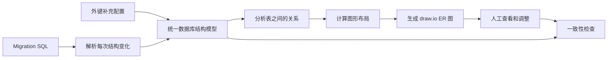
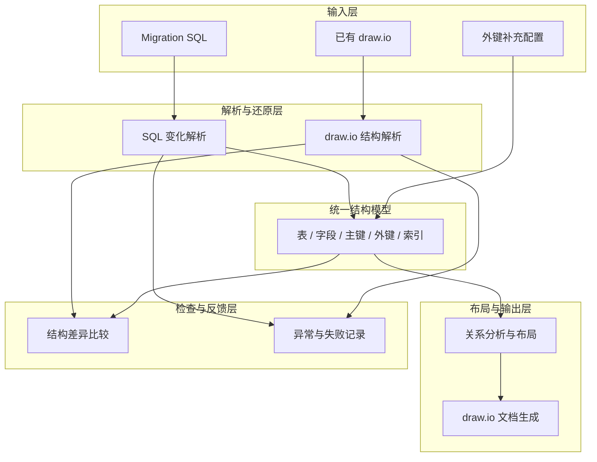

# 从 Database Migration 自动生成 ER 图

---

## 第 1 页：标题

### 从 Database Migration 自动生成 ER 图

**让持续变化的数据库结构，自动变成可读、可维护、可检查的架构图**

分享内容：

- 为什么要做这个项目
- 它解决了什么问题
- 整体架构和工作流程
- 关键设计决策
- 实现过程中遇到的困难
- 当前边界与后续方向

**讲解提示：**

这次不会重点介绍 SQL 解析或 XML 生成的具体代码，而是介绍这个项目为什么存在、整体如何运转，以及设计过程中做了哪些取舍。

---

## 第 2 页：项目背景

### 数据库一直在变化，但结构图很容易过期

随着业务持续迭代，数据库会不断发生变化：

- 创建新表
- 增加、删除或重命名字段
- 增加表之间的关系
- 创建或删除索引
- 调整原有表结构

这些变化通常被记录在大量 migration 文件中。

### 由此产生的问题

1. 新成员需要阅读大量 SQL 才能理解数据库。
2. 手工维护 ER 图需要重复劳动。
3. migration 更新后，ER 图经常没有同步更新。
4. 一些关系只存在于代码中，数据库本身没有外键。
5. 缺少自动方法判断 ER 图是否已经落后于代码。

> Migration 适合机器执行，但不适合人快速建立整体认知。

**讲解提示：**

可以先问大家一个问题：“我们现在看到的数据库结构图，能确定它和最新代码完全一致吗？”\
这个项目就是从这个问题出发的。

---

## 第 3 页：项目要解决什么问题

### 核心目标

将数据库 migration 自动转换成可以在 draw.io 中查看和编辑的 ER 图。

```text
大量 Migration SQL
        ↓
还原当前数据库结构
        ↓
生成一张可读的 ER 图
```

### 项目提供的四类能力

| 能力 | 作用 |
|---|---|
| 自动生成 | 从 migration 生成 `.drawio` ER 图 |
| 关系补全 | 补充数据库没有显式声明的业务关系 |
| 反向提取 | 从已有 draw.io 中提取表关系 |
| 一致性检查 | 比较 migration 与 ER 图之间的差异 |

> 它不只是一个画图工具，而是一条数据库结构文档的自动化链路。

---

## 第 4 页：用一个简单案例理解需求

假设一个电商系统最开始只有用户和订单：

```sql
CREATE TABLE users (
    id BIGINT PRIMARY KEY,
    email TEXT NOT NULL
);

CREATE TABLE orders (
    id BIGINT PRIMARY KEY,
    user_id BIGINT REFERENCES users(id),
    state TEXT NOT NULL
);
```

人可以从这段 SQL 中看出：

```text
users
  id
  email
    │
    │ 一个用户可以有多个订单
    ▼
orders
  id
  user_id
  state
```

当项目只有两张表时，人工理解和画图都不困难。

但真实项目会继续演进：

```text
V1：创建 users 和 orders
V2：增加 products 和 order_items
V3：修改 users 字段
V4：将 orders 重命名为 purchase_orders
V5：创建并删除临时表
V6：为 users 增加 role_id 和 manager_id
```

这时，最终结构已经无法通过只看某一个文件得到。

---

## 第 5 页：核心思路——重放数据库的变化历史

Migration 记录的不是数据库最终状态，而是每一步变化。

项目会按顺序读取文件，并持续更新一份数据库结构模型：

```text
初始状态：空
    │
    ├─ V1：创建 users、orders
    │
    ├─ V2：创建 products、order_items
    │
    ├─ V3：users.name 改名为 full_name
    │
    ├─ V4：orders 改名为 purchase_orders
    │
    ├─ V5：创建 temp_audit，然后又删除
    │
    └─ V6：users 增加 role_id、manager_id
    ▼
得到当前数据库的最终结构
```

### 案例中的最终结果

- 最终应该存在 `purchase_orders`，而不是 `orders`
- `users` 中应该存在 `full_name`，而不是 `name`
- `temp_audit` 最终不应该出现在图中
- `order_items` 应该继续指向重命名后的 `purchase_orders`

> 核心不是“扫描出所有表名”，而是“正确还原变化后的最终状态”。

---

## 第 6 页：整体工作流程



### 用案例串联整个流程

1. 读取 `V1` 到 `V6` 的 SQL 文件。
2. 按顺序应用创建、修改、重命名和删除操作。
3. 得到 `users`、`purchase_orders`、`products` 等最终结构。
4. 使用额外配置补充 `users.role_id → roles.id`。
5. 根据表之间的关系安排位置。
6. 输出可以直接在 draw.io 中打开的 ER 图。
7. 后续再次修改 migration 时，可以检查原图是否已经过期。

---

## 第 7 页：整体架构



### 各层职责

| 层次 | 负责什么 |
|---|---|
| 输入层 | 接收 migration、补充配置和已有图 |
| 解析与还原层 | 理解数据库变化和图中的节点关系 |
| 统一结构模型 | 保存当前数据库结构，隔离输入与输出 |
| 布局与输出层 | 决定表的位置并生成 draw.io |
| 检查与反馈层 | 报告差异、异常和不支持的内容 |

---

## 第 8 页：关键设计决策

### 1. 不连接数据库

直接把 migration 作为结构来源。

好处：

- 不需要数据库账号和网络权限
- 不接触真实业务数据
- 可以在本地或 CI 中运行
- 更容易审计结构从哪里产生

代价：

- migration 必须能够代表真实数据库结构
- 绕过 migration 的人工数据库修改无法被发现

### 2. 先建立统一模型，再生成图

```text
Migration → 数据库结构模型 → 布局 → draw.io
```

没有让 SQL 解析逻辑直接操作 draw.io。

这样可以：

- 将“理解数据库”和“画图”分开
- 复用同一模型做差异检查
- 将来增加其他输出格式
- 更容易定位问题属于哪一层

### 3. 输出可编辑格式

自动化负责生成基础结构，用户可以继续在 draw.io 中：

- 移动表的位置
- 增加颜色和分组
- 增加业务说明
- 调整适合演示的布局

> 自动化完成机械工作，人工保留表达空间。

---

## 第 9 页：数据库没有外键怎么办

### 现实问题

一些系统会在应用代码中维护关系，但没有在数据库中声明外键。

例如：

```sql
ALTER TABLE users ADD COLUMN role_id BIGINT;
```

从数据库定义本身，只能知道 `role_id` 是一个数字，无法知道它指向 `roles.id`。

### 解决办法

项目允许通过独立配置补充关系：

```yaml
users:
  fks:
    - [role_id, roles, id]
    - [manager_id, users, id]
```

这表示：

```text
users.role_id    ──────▶ roles.id
users.manager_id ──────▶ users.id
```

项目还支持在 SQL 注释中提供关系提示：

```sql
product_id BIGINT -- FK products(id)
```

### 对应的设计原则

- 数据库声明的关系优先
- 应用层关系可以显式补充
- 补充信息不需要修改原始 migration
- 所有关系最终进入同一结构模型

---

## 第 10 页：困难一——如何正确还原最终状态

### 问题

同一个对象可能被连续修改：

```text
创建 orders
    ↓
为 orders 增加字段
    ↓
将 orders 重命名为 purchase_orders
    ↓
删除之前创建的索引
```

如果只是从文件中收集信息，可能同时画出：

- `orders`
- `purchase_orders`
- 已经被删除的索引
- 已经不存在的临时表

### 解决方案

项目维护一份持续变化的结构状态：

```text
每读到一条变化
       ↓
更新当前结构模型
       ↓
同步相关主键、外键和索引
       ↓
全部 migration 完成后才生成图
```

例如 `orders` 重命名后：

- 表名变为 `purchase_orders`
- 指向 `orders` 的关系同步更新
- 最终图中不再出现旧表名

---

## 第 11 页：困难二——SQL 写法多且复杂

### 问题

同样的数据库关系可以有不同写法：

```sql
-- 字段内声明
user_id BIGINT REFERENCES users(id)
```

```sql
-- 表级声明
FOREIGN KEY (user_id) REFERENCES users(id)
```

```sql
-- 后续增加
ALTER TABLE orders
ADD CONSTRAINT orders_user_fk
FOREIGN KEY (user_id) REFERENCES users(id);
```

此外还存在：

- 字段和表重命名
- 唯一索引
- 条件索引
- 表达式索引
- 不同数据库的特殊语法

### 解决方案

1. 使用成熟的 SQL 解析能力理解语法结构。
2. 聚焦 ER 图真正需要的信息。
3. 优先可靠支持常见 PostgreSQL DDL。
4. 对暂不支持的内容输出明确警告。
5. 保存来源文件、失败原因和 SQL 片段，方便排查。

> 不追求“看起来什么都支持”，而是让已经支持的结果可解释、可检查。

---

## 第 12 页：困难三——自动生成的图如何保持可读

### 问题

表数量增加后，简单排列会出现：

- 连线交叉
- 相关表距离过远
- 表和说明文字重叠
- 整张图过宽或过高

### 解决方案

项目提供两种布局策略：

#### 默认分层布局

根据外键关系，将被依赖的表放在较前层。

```text
users          products
  │                │
  ▼                ▼
purchase_orders  order_items
       │            ▲
       └────────────┘
```

#### Graphviz 自动布局

对于关系更复杂的图，可以使用图布局工具自动计算位置。

同时保留以下调整能力：

- 每行放多少张表
- 表之间的距离
- 整体缩放
- 切换不同布局方式

如果高级布局不可用，系统会退回基础布局。

最终结果仍然可以在 draw.io 中人工整理。

---

## 第 13 页：形成文档维护闭环

生成图以后，用户可能在 draw.io 中继续移动节点、增加分组或手工补充连线。

因此项目增加了两个反向能力。

### 从 draw.io 提取关系

```text
已有 draw.io
      ↓
识别表、字段和连线
      ↓
生成外键 YAML
```

如果某条连线缺少起点或终点，系统会输出异常报告，而不是静默忽略。

### 比较图和 migration

```text
最新 Migration ──▶ 数据库结构快照
                              │
                              ▼
                          差异报告
                              ▲
                              │
现有 draw.io ─────▶ 图结构快照
```

报告会指出：

- 哪些表只存在于 migration
- 哪些表只存在于图中
- 图中缺少或多出的字段
- 不一致的外键
- 不一致的索引

> 最终目标不是只生成一次图，而是让图能够持续跟随代码变化。

---

## 第 14 页：项目价值与适用场景

### 对开发人员

- 减少重复画图工作
- 快速理解 migration 的整体影响
- 在代码评审时辅助检查结构变化

### 对新成员

- 不需要先阅读全部 migration
- 通过图快速理解核心数据关系
- 降低项目上手成本

### 对非研发成员

- 用业务对象和关系理解系统
- 不需要理解具体 SQL
- 更适合跨团队讨论数据模型

### 适合的使用场景

- 已有大量 migration，但缺少最新 ER 图
- ER 图需要定期更新
- 数据库关系复杂，新成员理解困难
- 希望在 CI 中检查数据库文档是否过期

---

## 第 15 页：当前边界

这个项目目前不是：

- 数据库管理平台
- 完整的 SQL 执行引擎
- 数据内容或数据质量检查工具
- 支持所有数据库的通用解析器
- 完全替代人工设计的绘图工具

目前主要关注：

- PostgreSQL 风格 migration
- 表和字段
- 主键与外键
- 唯一约束和索引
- 常见的创建、修改、重命名和删除操作

暂不重点支持：

- View、物化视图的完整建模
- Enum
- `CHECK` 约束
- 分区表
- 数据库特有扩展
- 高度复杂的动态 SQL

**讲解提示：**

主动说明边界，可以强调这是一个聚焦数据库结构可视化的工具，而不是重新实现数据库本身。

---

## 第 16 页：后续演进方向

### 第一阶段：提高可靠性

- 增加系统化自动测试
- 增加更多真实 migration 案例
- 进一步区分警告和阻断性错误
- 提供统一的构建和验证命令

### 第二阶段：接入开发流程

- migration 变化后自动生成 ER 图
- 在 CI 中自动执行一致性检查
- ER 图过期时在 Pull Request 中提示
- 生成不同版本之间的结构变化报告

### 第三阶段：增强展示能力

- 按业务域生成局部 ER 图
- 自动对新增、删除和修改内容着色
- 支持更多输出格式
- 支持更多数据库方言

---

## 第 17 页：技术栈

技术细节放在分享最后，简单说明每项技术解决什么问题即可。

| 技术 | 在项目中的作用 |
|---|---|
| Python 3.9+ | 项目主要开发语言 |
| sqlglot | 将 PostgreSQL SQL 转换成可分析的语法结构 |
| NetworkX | 分析表之间的依赖关系和层级 |
| Graphviz / pydot | 可选的复杂关系自动布局 |
| PyYAML | 读取和输出外键补充配置 |
| XML | 生成和解析 draw.io 文档 |
| draw.io / diagrams.net | 查看和人工编辑最终 ER 图 |

技术依赖保持单向：

```text
命令入口
   ↓
SQL / draw.io 解析
   ↓
统一数据库结构模型
   ↓
布局计算
   ↓
draw.io 输出
```

---

## 第 18 页：总结

### 这个项目做了什么

把数据库的变化历史，自动转换为一张可阅读的结构地图。

### 它最重要的三个特点

1. **自动生成**：减少手工维护成本。
2. **可人工编辑**：保留 draw.io 的表达能力。
3. **可检查一致性**：帮助发现图和 migration 的偏差。

### 一句话总结

> 让 migration 不只是数据库的执行脚本，也成为数据库架构文档的事实来源。

---

# 附录 A：完整案例回顾

可以把下面内容作为现场演示页或备用页。

## 输入：连续的数据库变化

```text
V1
├── 创建 users
└── 创建 orders，关联 users

V2
├── 创建 products
└── 创建 order_items，关联 orders 和 products

V3
├── users.name → users.full_name
└── 为 users 增加 status 和索引

V4
├── orders → purchase_orders
└── orders.state → purchase_orders.order_state

V5
└── 创建并删除 temp_audit

V6
├── 创建 roles
├── users 增加 role_id
└── users 增加 manager_id
```

## 补充关系

```yaml
users:
  fks:
    - [role_id, roles, id]
    - [manager_id, users, id]

order_items:
  fks:
    - [order_id, purchase_orders, id]
    - [product_id, products, id]
```

## 输出：最终结构

```text
roles
  id
  role_name
   ▲
   │ role_id
   │
users ───────────────┐
  id                 │ manager_id
  email              │
  full_name          │
  status             │
  role_id            │
  manager_id ────────┘
   ▲
   │ user_id
   │
purchase_orders
  id
  user_id
  order_state
   ▲
   │ order_id
   │
order_items ─────────────▶ products
  order_id      product_id   id
  product_id                 product_name
  quantity                   price
  price_per_unit
```

需要注意：

- 图中没有已经被重命名的 `orders`
- 图中没有已经删除的 `temp_audit`
- `users.name` 已经变为 `users.full_name`
- 数据库没有声明的 `role_id` 和 `manager_id` 关系通过配置补全

---

# 附录 B：可选现场演示流程

如果分享现场条件允许，可以安排 2～3 分钟演示。

## 1. 展示 migration 目录

```text
db/migration/
├── V1__create_users_and_orders.sql
├── V2__create_products_and_order_items.sql
├── V3__evolve_users.sql
├── V4__orders_and_indexes.sql
├── V5__temporary_structures.sql
└── V6__roles_and_managers.sql
```

## 2. 生成 ER 图

```bash
python3 gen_drawio_erd_table.py \
  --migrations ./db/migration \
  --out ./schema.drawio \
  --show-types \
  --layout grid \
  --fk-config sample_fk_config.yaml
```

## 3. 在 draw.io 中打开

重点展示：

- 表和字段自动生成
- 主键和外键说明
- 外键连接到具体字段
- `orders` 已经变成 `purchase_orders`
- YAML 补充的关系已经出现在图中

## 4. 执行一致性检查

```bash
python3 compare_drawio_to_migrations.py \
  ./db/migration \
  ./schema.drawio \
  --out schema_diff.txt
```

演示时可以人工修改或删除图中的一个字段，再运行比较，让报告展示差异。

---

# 附录 C：可能被问到的问题

## 为什么不直接连接数据库生成 ER 图？

连接数据库需要账号、网络和环境权限，也可能接触生产数据。Migration 更容易进入本地开发和 CI 流程，而且可以清楚追踪结构变化来源。

## 如果有人直接修改数据库，没有写 migration 怎么办？

这个项目无法自动发现。这也是方案的边界：它假设 migration 是数据库结构的事实来源。未来可以增加数据库快照作为另一种输入进行交叉检查。

## 为什么选择 draw.io，而不是直接生成图片？

图片只能看，draw.io 可以继续编辑、分组和添加业务说明，更适合团队评审和长期维护。

## 自动布局能完全替代人工调整吗？

不能。自动布局负责提供可用初稿，复杂业务图仍可能需要人工优化。项目保留 draw.io 可编辑性就是为了处理这部分需求。

## 数据库中没有外键怎么办？

可以通过 SQL 注释或 YAML 配置补充应用层关系，不需要修改原始数据库约束。

## 是否支持所有数据库？

目前主要面向常用 PostgreSQL DDL。架构上解析、模型和输出相互分离，未来可以增加其他数据库方言，但当前不会宣称全面支持。

## 遇到不能识别的 SQL 会怎样？

系统会保留警告和失败日志，说明来源文件、失败原因及相关 SQL，不会把无法识别的内容静默当作成功。
